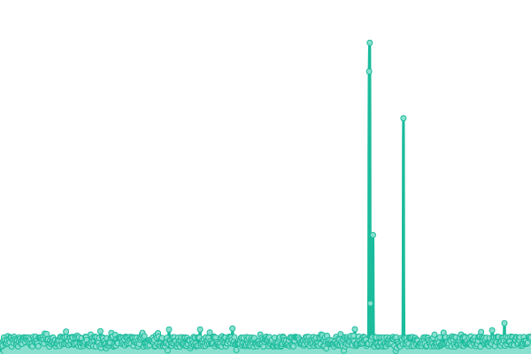
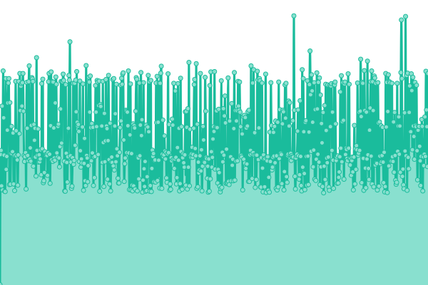
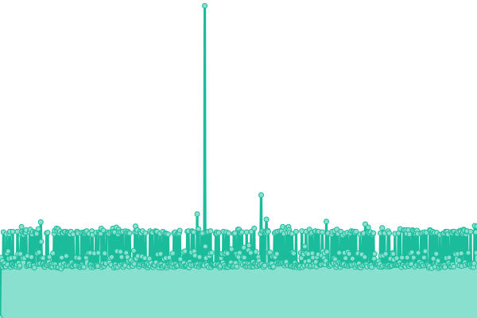
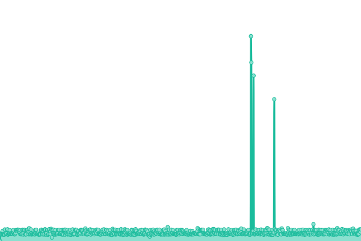

# [📈 Live Status](https://status.wireway.ch): <!--live status--> **🟩 All systems operational**

This repository contains the open-source uptime monitor and status page for [wirewayproject](https://status.wireway.ch), powered by [Upptime](https://github.com/upptime/upptime).

With [Upptime](https://upptime.js.org), you can get your own unlimited and free uptime monitor and status page, powered entirely by a GitHub repository. We use [Issues](https://github.com/wirewayproject/uptime/issues) as incident reports, [Actions](https://github.com/wirewayproject/uptime/actions) as uptime monitors, and [Pages](https://status.wireway.ch) for the status page.

<!--start: status pages-->
<!-- This summary is generated by Upptime (https://github.com/upptime/upptime) -->
<!-- Do not edit this manually, your changes will be overwritten -->
<!-- prettier-ignore -->
| URL | Status | History | Response Time | Uptime |
| --- | ------ | ------- | ------------- | ------ |
|  [Proxy](https://wireway.ch/api/status/nodes/?node=1) | 🟩 Up | [proxy.yml](https://github.com/wirewayproject/uptime/commits/HEAD/history/proxy.yml) | 

 435ms
     
 | 

<a href="https://status.wireway.ch/history/proxy">100.00%</a>
    

|  [cluster1 [ 2 nodes ]](https://wireway.ch/api/status/nodes/?node=2) | 🟩 Up | [cluster1-2-nodes.yml](https://github.com/wirewayproject/uptime/commits/HEAD/history/cluster1-2-nodes.yml) | 

 134ms
     
 | 

<a href="https://status.wireway.ch/history/cluster1-2-nodes">100.00%</a>
    

|  [cluster2 [ 32 nodes ]](https://wireway.ch/api/status/nodes/?node=3) | 🟩 Up | [cluster2-32-nodes.yml](https://github.com/wirewayproject/uptime/commits/HEAD/history/cluster2-32-nodes.yml) | 

 131ms
     
 | 

<a href="https://status.wireway.ch/history/cluster2-32-nodes">100.00%</a>
    

|  [r-place.ch](https://r-place.ch) | 🟩 Up | [r-place-ch.yml](https://github.com/wirewayproject/uptime/commits/HEAD/history/r-place-ch.yml) | 

 443ms
     
 | 

<a href="https://status.wireway.ch/history/r-place-ch">100.00%</a>
    

|  [r-place.ch Pocketbase](https://pocketbase.r-place.ch/_/) | 🟩 Up | [r-place-ch-pocketbase.yml](https://github.com/wirewayproject/uptime/commits/HEAD/history/r-place-ch-pocketbase.yml) | 

 435ms
     
 | 

<a href="https://status.wireway.ch/history/r-place-ch-pocketbase">100.00%</a>
    

|  [r/place](https://www.reddit.com/r/place/) | 🟩 Up | [r-place.yml](https://github.com/wirewayproject/uptime/commits/HEAD/history/r-place.yml) | 

 721ms
     
 | 

<a href="https://status.wireway.ch/history/r-place">100.00%</a>
    

|  [controller1](https://wireway.ch/api/status/controller/?id=1) | 🟩 Up | [controller1.yml](https://github.com/wirewayproject/uptime/commits/HEAD/history/controller1.yml) | 

 128ms
     
 | 

<a href="https://status.wireway.ch/history/controller1">100.00%</a>
    

|  [controller2](https://wireway.ch/api/status/controller/?id=2) | 🟩 Up | [controller2.yml](https://github.com/wirewayproject/uptime/commits/HEAD/history/controller2.yml) | 

 129ms
     
 | 

<a href="https://status.wireway.ch/history/controller2">100.00%</a>
    

|  [controller3](https://wireway.ch/api/status/controller/?id=3) | 🟩 Up | [controller3.yml](https://github.com/wirewayproject/uptime/commits/HEAD/history/controller3.yml) | 

 131ms
     
 | 

<a href="https://status.wireway.ch/history/controller3">100.00%</a>
    

|  [controller4](https://wireway.ch/api/status/controller/?id=4) | 🟩 Up | [controller4.yml](https://github.com/wirewayproject/uptime/commits/HEAD/history/controller4.yml) | 

 129ms
     
 | 

<a href="https://status.wireway.ch/history/controller4">100.00%</a>
    

|  [UPS](https://wireway.ch/api/status/ups/) | 🟩 Up | [ups.yml](https://github.com/wirewayproject/uptime/commits/HEAD/history/ups.yml) | 

 129ms
     
 | 

<a href="https://status.wireway.ch/history/ups">100.00%</a>
    

|  [Wireway Website](https://wireway.ch) | 🟩 Up | [wireway-website.yml](https://github.com/wirewayproject/uptime/commits/HEAD/history/wireway-website.yml) | 

 131ms
     
 | 

<a href="https://status.wireway.ch/history/wireway-website">100.00%</a>
    

|  [Wireway Speedtest](https://speedtest.wireway.ch) | 🟩 Up | [wireway-speedtest.yml](https://github.com/wirewayproject/uptime/commits/HEAD/history/wireway-speedtest.yml) | 

 436ms
     
 | 

<a href="https://status.wireway.ch/history/wireway-speedtest">100.00%</a>
    

|  [Wireway Autoajax](https://autoajax.wireway.ch) | 🟩 Up | [wireway-autoajax.yml](https://github.com/wirewayproject/uptime/commits/HEAD/history/wireway-autoajax.yml) | 

 428ms
     
 | 

<a href="https://status.wireway.ch/history/wireway-autoajax">100.00%</a>
    

|  [Wireway CLI](https://wireway.ch/cli.html) | 🟩 Up | [wireway-cli.yml](https://github.com/wirewayproject/uptime/commits/HEAD/history/wireway-cli.yml) | 

 129ms
     
 | 

<a href="https://status.wireway.ch/history/wireway-cli">100.00%</a>
    

|  [obvTiger Website](https://obvtiger.ch) | 🟩 Up | [obv-tiger-website.yml](https://github.com/wirewayproject/uptime/commits/HEAD/history/obv-tiger-website.yml) | 

 432ms
     
 | 

<a href="https://status.wireway.ch/history/obv-tiger-website">100.00%</a>
    

|  [obvTiger CDN](https://cdn.obvtiger.ch) | 🟩 Up | [obv-tiger-cdn.yml](https://github.com/wirewayproject/uptime/commits/HEAD/history/obv-tiger-cdn.yml) | 

 550ms
     
 | 

<a href="https://status.wireway.ch/history/obv-tiger-cdn">100.00%</a>
    

|  [ShieldBreak Website](https://www.shield-break.net) | 🟩 Up | [shield-break-website.yml](https://github.com/wirewayproject/uptime/commits/HEAD/history/shield-break-website.yml) | 

 428ms
     
 | 

<a href="https://status.wireway.ch/history/shield-break-website">100.00%</a>
    

|  [ShieldBreak CDN](https://cdn.shield-break.net) | 🟩 Up | [shield-break-cdn.yml](https://github.com/wirewayproject/uptime/commits/HEAD/history/shield-break-cdn.yml) | 

 426ms
     
 | 

<a href="https://status.wireway.ch/history/shield-break-cdn">100.00%</a>
    

|  [MCServerSearch](https://mcserversearch.com) | 🟩 Up | [mc-server-search.yml](https://github.com/wirewayproject/uptime/commits/HEAD/history/mc-server-search.yml) | 

 428ms
     
 | 

<a href="https://status.wireway.ch/history/mc-server-search">100.00%</a>
    

|  [Grafana](https://grafana.bubicloud.ch/login) | 🟩 Up | [grafana.yml](https://github.com/wirewayproject/uptime/commits/HEAD/history/grafana.yml) | 

 95ms
     
 | 

<a href="https://status.wireway.ch/history/grafana">100.00%</a>
    

|  [eniv.app](https://eniv.app) | 🟩 Up | [eniv-app.yml](https://github.com/wirewayproject/uptime/commits/HEAD/history/eniv-app.yml) | 

 439ms
     
 | 

<a href="https://status.wireway.ch/history/eniv-app">100.00%</a>
    

|  [eniv.app Preview](https://preview.eniv.app) | 🟩 Up | [eniv-app-preview.yml](https://github.com/wirewayproject/uptime/commits/HEAD/history/eniv-app-preview.yml) | 

 429ms
     
 | 

<a href="https://status.wireway.ch/history/eniv-app-preview">100.00%</a>
    

|  [DB1 Present](https://www.shield-break.net/db.php?db=db1) | 🟩 Up | [db-1-present.yml](https://github.com/wirewayproject/uptime/commits/HEAD/history/db-1-present.yml) | 

 375ms
     
 | 

<a href="https://status.wireway.ch/history/db-1-present">100.00%</a>
    

|  [DB2 Present](https://www.shield-break.net/db.php?db=db2) | 🟩 Up | [db-2-present.yml](https://github.com/wirewayproject/uptime/commits/HEAD/history/db-2-present.yml) | 

 133ms
     
 | 

<a href="https://status.wireway.ch/history/db-2-present">100.00%</a>
    

|  [DB3 Present](https://www.shield-break.net/db.php?db=db3) | 🟩 Up | [db-3-present.yml](https://github.com/wirewayproject/uptime/commits/HEAD/history/db-3-present.yml) | 

 129ms
     
 | 

<a href="https://status.wireway.ch/history/db-3-present">100.00%</a>
    

|  [DB1 Replica Present](https://www.shield-break.net/db.php?db=db1&r=true) | 🟩 Up | [db-1-replica-present.yml](https://github.com/wirewayproject/uptime/commits/HEAD/history/db-1-replica-present.yml) | 

 131ms
     
 | 

<a href="https://status.wireway.ch/history/db-1-replica-present">100.00%</a>
    

|  [DB2 Replica Present](https://www.shield-break.net/db.php?db=db2&r=true) | 🟩 Up | [db-2-replica-present.yml](https://github.com/wirewayproject/uptime/commits/HEAD/history/db-2-replica-present.yml) | 

 129ms
     
 | 

<a href="https://status.wireway.ch/history/db-2-replica-present">100.00%</a>
    

|  [DB3 Replica Present](https://www.shield-break.net/db.php?db=db3&r=true) | 🟩 Up | [db-3-replica-present.yml](https://github.com/wirewayproject/uptime/commits/HEAD/history/db-3-replica-present.yml) | 

 132ms
     
 | 

<a href="https://status.wireway.ch/history/db-3-replica-present">100.00%</a>
    

|  [CaveAttack](https://caveattack.shield-break.net/) | 🟩 Up | [cave-attack.yml](https://github.com/wirewayproject/uptime/commits/HEAD/history/cave-attack.yml) | 

 421ms
     
 | 

<a href="https://status.wireway.ch/history/cave-attack">100.00%</a>
    

|  [CaveAtatck Map](https://caveattack.shield-break.net/map/) | 🟩 Up | [cave-atatck-map.yml](https://github.com/wirewayproject/uptime/commits/HEAD/history/cave-atatck-map.yml) | 

 139ms
     
 | 

<a href="https://status.wireway.ch/history/cave-atatck-map">97.48%</a>
    

|  [Discardium](https://discardium.com) | 🟩 Up | [discardium.yml](https://github.com/wirewayproject/uptime/commits/HEAD/history/discardium.yml) | 

 432ms
     
 | 

<a href="https://status.wireway.ch/history/discardium">100.00%</a>
    

|  [Bubicloud](https://cloud.bubicloud.ch) | 🟩 Up | [bubicloud.yml](https://github.com/wirewayproject/uptime/commits/HEAD/history/bubicloud.yml) | 

 94ms
     
 | 

<a href="https://status.wireway.ch/history/bubicloud">100.00%</a>
    

|  [Analytics](https://analytics.shield-break.net) | 🟩 Up | [analytics.yml](https://github.com/wirewayproject/uptime/commits/HEAD/history/analytics.yml) | 

 577ms
     
 | 

<a href="https://status.wireway.ch/history/analytics">100.00%</a>
    

|  [loadbalancer group](https://wireway.ch/api/status/lb/?id=group) | 🟩 Up | [loadbalancer-group.yml](https://github.com/wirewayproject/uptime/commits/HEAD/history/loadbalancer-group.yml) | 

 362ms
     
 | 

<a href="https://status.wireway.ch/history/loadbalancer-group">100.00%</a>
    

<!--end: status pages-->

[**Visit our status website →**](https://status.wireway.ch)

## 📄 License

- Powered by: [Upptime](https://github.com/upptime/upptime)
- Code: [MIT](./LICENSE) © [wirewayproject](https://status.wireway.ch)
- Data in the `./history` directory: [Open Database License](https://opendatacommons.org/licenses/odbl/1-0/)
